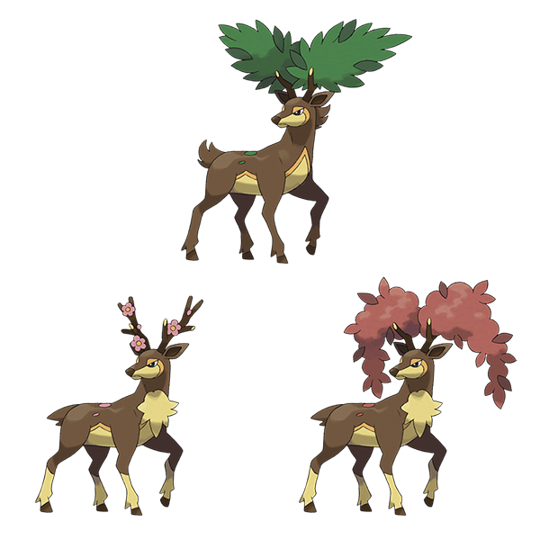

Machine learning provides techniques that allow us to "reverse engineer" both natural and artificial phenomena in order to uncover their underlying processes. Given the ubiquity of black-box algorithmic control in society, the latter type of phenomena is probably more deserving of reverse engineering. In this workshop, the fundamental mindset and basic techniques of machine learning will be introduced through a narrative of a totally surveilled and quantified society based on the show Psycho-Pass and anxieties around programs like Sesame Credit. You'll learn how to think about the world in the "machine learning" way - from an intuitive mathematical perspective - and use popular Python programs to apply this new thinking to just about anything.

Prerequisites:

- some basic familiarity with Python
- some knowledge of math (algebra and a dash of calculus)

Goals of the workshop: to walk away with...

- an intuition about how machine learning works and what it does
- an ability to identify where and how machine learning can be applied
- some basic familiarity with `scikit-learn`
- some basic familiarity with fundamental machine learning methods
- a sense of the ethical dilemmas of machine learning applications

---

This is a series of iPython notebooks for "Machine Learning 101" workshops.

Concepts are taught via two "stories", one for natural phenomena and one for artificial phenomena:

- a deer researcher
- a journalist in a [Psycho-Pass](https://en.wikipedia.org/wiki/Psycho-Pass)-esque world (or the real world now, I guess, cf. [Sesame Credit](http://qz.com/519737/all-chinese-citizens-now-have-a-score-based-on-how-well-we-live-and-mine-sucks/) and [see also](https://danielmiessler.com/blog/chinas-new-dystopian-citizen-rating-system/))

All data is generated via the `data/data_generation.ipynb` notebook to be tailored for the workshop.

## Setup

    pip install -r requirements.txt
    jupyter notebook

Then look in the `notebooks` folder.

---

