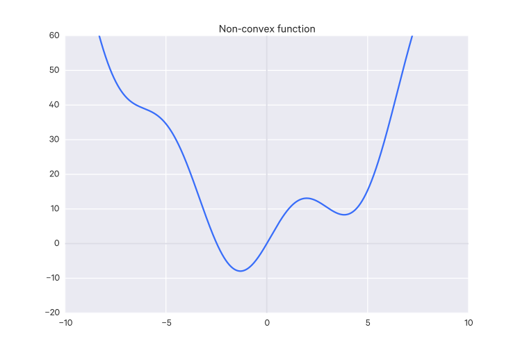
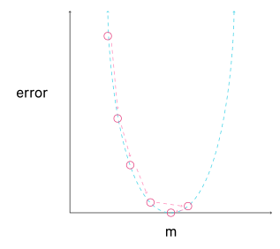
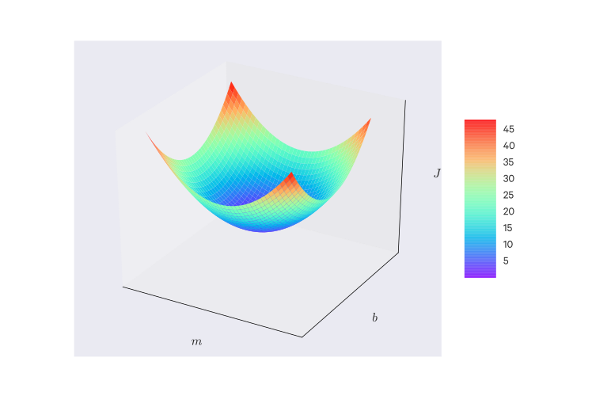
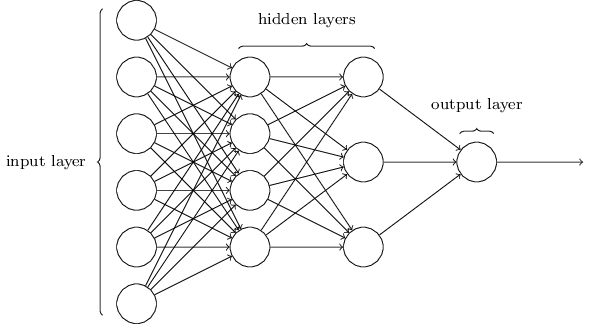
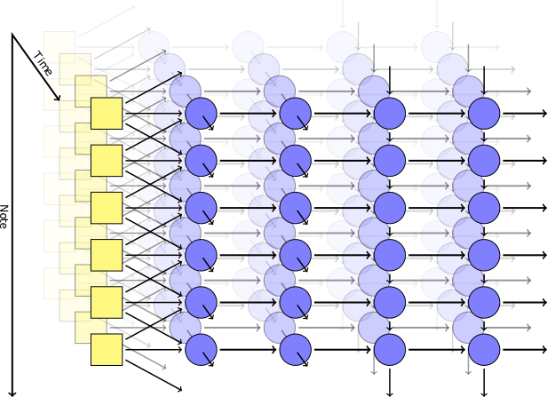

# ML101

Francis Tseng (@frnsys)

---

## What do you know about machine learning? 💬

---

ok, so what the heck is machine learning doing? what is it even for?

## 💻🤔

---

## ✨~modeling the world~✨

---

we can model phenomena, both natural and artificial, as mathematical functions

# y ⟶ $f(x)$
# 💫 ⟶ $f(⚛)$
# 💹 ⟶ $f(📰)$
# 🎼 ⟶ $f(🎼)$
# 🎼 ⟶ $f(🎼,😶)$

---

how could we come up with such a function? 🤔

there are _infinitely_ many of them

---

we could go and observe a lot of things and then try to figure out some equation that matched what we observed.

# 🌎👀

---

but that is a tedious process...

---

ok, let's have computers do it for us then

# 🤖

---

this is in essence what "machine learning" is:

### _using computers to learn functions from observations (data)_

---

once you learn your mystery function, there's so much you can do with it:

- predict things
- automate things/make decisions
- gain insight into a system
- emulate a system

---

let's get more concrete

# 🐄

---

let's say you're a farmer. you have a herd of cows.

🐄🐄🐄🐄

you want to estimate how heavy a cow will grow to be given its birth weight.

---

you collect some data which looks like this:

###### (ignore the labels, this is from something else :\\)

---

we can try to learn a function that _fits_ this data; i.e. that best describes (models) the relationship between the birth weight and mature weight.

---

to better appreciate all the help computers give us, let's try this manually first.

---

this data looks like a line doesn't it?

---

remember that a line can be described in the general form of

$$
y = mx + b
$$

---

remember that lines vary depending on what the values of $m$ and $b$ are:

we say that $m$ and $b$ _parameterize_ the function ($m$ and $b$ are called "parameters").

---

these parameters define a unique function, and thus when we "learn" a particular function, we are actually learning these parameters!

---

if we wanted to learn these parameters manually, we could use the good old "guess-and-check" method:

---

this was an easy dataset - real world data may be much more convoluted, not describable by a line, in many more dimensions, etc...manually figuring out the function gets kinda hard then.

---

(example in notebook 🗒)

---

essentially every machine learning technique learns what these parameters are, and one of what differentiates algorithms is the approach with which they do this learning.

another main differentiator is what _kinds_ of functions the algorithm can learn - some can only learn lines, while others can learn much fancier functions.

---

## so how the heck does the algorithm learn the parameters?

# 🤔

---

it varies, but usually via a _cost_ or _objective_ function (often notated $J$).

this tells the algorithm how "wrong" it is with its current guesses for the parameters on the training data.

---

the algorithm iteratively tries different parameters (i.e. different guesses at the underlying function) until it can minimize this error.

that is, it tries to _optimize_ the parameters for the cost function.

---

different optimization algorithms have different ways of picking new guesses.

the most popular one is _gradient descent_, which looks for the direction in which the error is decreasing, and then takes a step in that direction.

# 🗻

---

if we were just finding $m$, this might look like:

---

if we're finding both $m$ and $b$, this might look like:

---

there are other optimization methods such as genetic algorithms, particle swarm optimization, etc...

but gradient descent is by far the most common.

---

another example:

# the office of social health

(based on the psycho-pass series)

---

## ok, let's switch gears and talk about 🎉~neural networks~🎉

they have many, many fun and interesting applications

---

a neural network does essentially what we were doing before, but it can learn more sophisticated functions 💪🏽

---

###### (from [neuralnetworksanddeeplearning.com](http://neuralnetworksanddeeplearning.com/))

---

one particularly fun kind of neural network is a _recurrent neural network_

###### (from [hexahedria](http://www.hexahedria.com/2015/08/03/composing-music-with-recurrent-neural-networks/))

these are great for modeling _sequences_, e.g. text📝, music🎶, time series🕐, and so on

---

there are examples abound here, such as generated texts in the style of [Finnegan's Wake](https://www.countbayesie.com/blog/2015/5/24/writing-finnegans-wake-with-a-recurrent-neural-net), endless new episode scripts for [Full House](http://fullest.house/), and algorithimically-composed [sheet music](https://medium.com/dbrs-innovation-labs/in-his-novel-galatea-2-2-e9d11c9b7c2a#.xd00cremz).

---

sounds like a lot of fun, but there's one hangup...

# 🙁

---

## what if the inputs we want to use aren't numbers? 🤔

for example, how do you put a piece of text into a function?

# 📖 ⟶ 🔢

how do you _represent_ it as a number?

---

this is the problem of _representation_, and it is key to machine learning.

coming up with good representations is called _feature engineering_ and it can be more of an art than a skill.

# 🛠 + 🎨

---

for text, one option is to map each word to a unique number.

# 🙃

---

(example in notebook 🗒)

---

one last kind of machine learning that I really enjoy:

## reinforcement learning

# 🐶

---

what we've seen so far is pretty cool, but things _really_ get fun when we start designing agents that can act independently;

where they can interact with an environment on their own, learn from it, and develop new behaviors 🤖

---

reinforcement learning is behind neat stuff like Google DeepMind's _AlphaGo_ 🏆 and their [Atari-playing AIs](https://www.youtube.com/watch?v=Vr5MR5lKOc8) 🕹

---

the behavior of the agent can be described by (you guessed it) a function, and of course we want to learn it 🎓

---

the basic idea:

- we model the world as various _states_ 🙍🏽 the agent can be in.
- the agent can take _actions_ 🏧 that move between these states.
- each state has an associated _reward_ 💰 (or punishment 🗡).
- the agent _explores_ 🗺 these states and learns which sequence of actions tend to lead to more rewards.

this is given to us by a function, usually called $q$, which, given a state, maps actions to values - so this is the function we want to learn.

---

a very simple set of agent states and actions. this agent will eventually spend all of its time sleeping 💤.

---

a very simple environment for a RL agent is a "grid world"

---

(example in notebook 🗒)

---

thanks!

if you want to go deeper: [frnsys.com/ai_notes/](http://frnsys.com/ai_notes/)

~ @frnsys